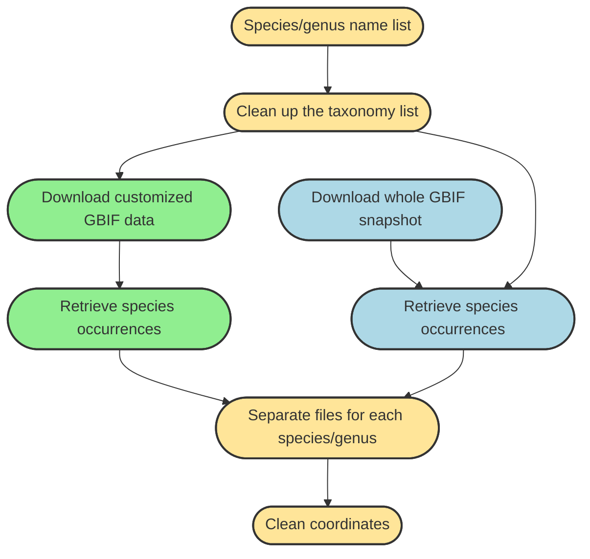

# GBIF-workflow

## Workflow Graph

```mermaid
flowchart TD
    A([Species/genus name list]):::general --> B([Clean up the taxonomy list]):::general
    C([Download customized GBIF data]):::method1 --> D([Retrieve species occurrences]):::method1
    B --> C
    
    E([Download whole GBIF snapshot]):::method2 --> F([Retrieve species occurrences]):::method2
    B --> F
    G([Separate files for each species/genus]):::general --> H([Clean coordinates]):::general
    D --> G
    F --> G


    classDef general fill:#ffe599,stroke:#333,stroke-width:2px;
    classDef method1 fill:#90ee90,stroke:#333,stroke-width:2px;
    classDef method2 fill:#ADD8E6,stroke:#333,stroke-width:2px;

    class A,B,G,H general;
    class C,D method1;
    class E,F method2;
```
