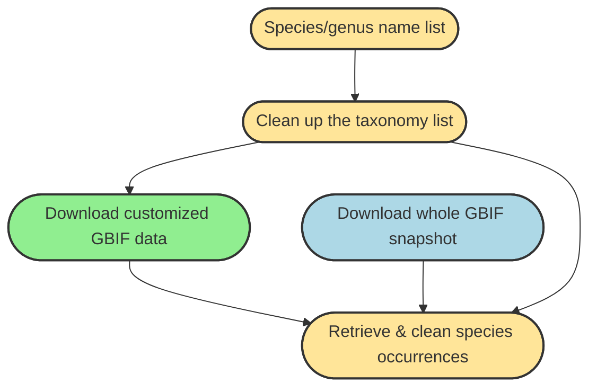

# GBIF-workflow

## Workflow Graph

```mermaid
flowchart TD
    A([Species/genus name list]):::general --> B([Clean up the taxonomy list]):::general
    C([Download customized GBIF data]):::method1 --> D([Retrieve & clean species occurrences]):::general
    B --> C
    
    E([Download whole GBIF snapshot]):::method2 --> D
    B --> D

    classDef general fill:#ffe599,stroke:#333,stroke-width:2px;
    classDef method1 fill:#90ee90,stroke:#333,stroke-width:2px;
    classDef method2 fill:#ADD8E6,stroke:#333,stroke-width:2px;

    class A,B,D general;
    class C method1;
    class E method2;
```
